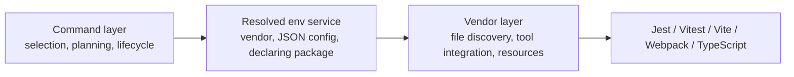
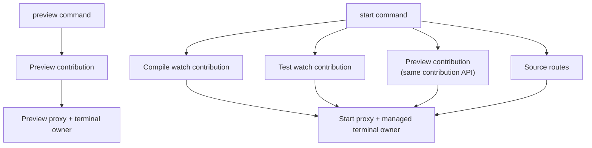

# Bit Lite

Bit Lite is an experiment in rebuilding the local component-development loop around a much smaller, more explicit runtime.

The original [Bit](https://bit.dev/) is a broad component platform. In addition to local compilation, testing, and previewing, it manages component identity and history, reusable platform extensions, distributed scopes, releases, imports, exports, and collaboration workflows. That breadth is valuable when the component platform itself is the system of record.

Bit Lite starts from a narrower question:

> What is the smallest understandable system that can develop independently configured components in one workspace?

The project focuses on that local loop: discover components, install their dependencies, link them as packages, compile them in dependency order, run tests, and serve docs and compositions. Versioning, remote scopes, publishing, and cross-workspace collaboration are intentionally outside its current scope.

## Why this project exists

Bit Lite explores how small and fast the local component-development loop can be when its state, execution layers, and process ownership are explicit.

### Small and fast

The implementation deliberately covers a narrow path and avoids loading a general extension platform for every operation. Commands read one static component registry, resolve only the selected env services, and start only the vendor processes required for that operation.

This keeps the runtime small and the feedback loop fast while leaving the implementation understandable enough to change as an architectural experiment.

### Worker-backed watch services with one managed terminal

One-shot vendor work can run inline, but watch-mode services run in worker threads. A worker owns the test runner, compiler watcher, or preview dev server without taking over the command process.

`ManagedTerminal` supervises these workers as logical tasks. It retains stdout and stderr, forwards raw input to an attached task, synchronizes terminal size, displays structured status and results, and coordinates bounded shutdown.

This is particularly important for `bit-lite test --watch`: long-lived Jest or Vitest processes, native watch input, repeated structured results, and other workspace tasks can coexist without competing for the parent terminal. The same solution also supports compile watch and preview dev servers.

### Separate, composable `preview` and `start` layers

`start` was originally the only browser-facing development command, but it is intentionally broad: it combines compile watch, test watch, previews, test-result routes, source browsing, a proxy, and a managed terminal. Developers often need only component previews, so `preview` exists as a smaller standalone command.

The separation is architectural, not just a second CLI spelling. Command implementations expose reusable contributions—tasks, routes, readiness, and disposal—so a higher-level command can compose lower-level command capabilities without spawning nested CLI processes. `preview` owns the focused preview experience; `start` reuses the preview contribution and adds compile, test, and source layers under one lifecycle owner.

### Command → env service → vendor

Every operation follows the same three-layer design:

1. **Command:** selects components, owns orchestration and lifecycle, and validates the result contract.
2. **Env service:** selects a vendor and JSON configuration while preserving which env package declared that service.
3. **Vendor:** integrates the external tool, discovers its files, and owns process-specific resources.

This boundary keeps workspace policy out of tool adapters and keeps Jest, Vitest, Vite, Webpack, and TypeScript out of the command layer.

### Lazy preview dev servers

Preview servers are relatively expensive when a workspace contains many components or several env groups. With `preview --lazy` or `start --lazy`, each env's preview task stays idle until a request reaches one of its known routes.

Lazy mode reduces startup time and resource pressure without making compile or test readiness implicit. Under `start --lazy`, compile and test tasks still start eagerly; only preview dev servers are deferred.

### Flattened JSON envs

An env component is authored as a small JSON definition and compiled into a validated, flattened `dist/index.json`. The compiled file materializes inherited services, custom config, the inheritance chain, and the declaring package of every service.

Runtime env resolution therefore reads static data instead of executing a deep chain of env scripts. An invalid env fails compilation or loading explicitly instead of silently changing behavior through a fallback to a default env. Flattening also reduces runtime coupling to deep env inheritance, although packages that provide inherited vendors or config modules must still be resolvable.

### Explicit component state and dependency isolation

Components are listed in the hand-authored `bit-lite.json`. The current prototype materializes each component's kind and runtime, development, and peer dependency records in `.comp.json`.

Keeping that state as plain JSON makes it easy to inspect exactly what Bit Lite believes about a component before an install, link, compile, or test operation. In that sense, `.comp.json` is a local, machine-readable debugging surface similar to the information exposed by `bit show` or `bit deps debug`.

It is not intended to remain a hand-authored configuration file. The longer-term design is for higher-level commands and dependency detectors to generate and update this state, with users treating it as read-only. Its location may also move to a more explicit generated-metadata area so that it is clear the file should not be edited manually.

External npm dependencies are installed into generated per-component pnpm projects, while local components are consumed through package links.

These choices improve explicitness, isolation, and ease of experimentation for this repository's goals. They are also deliberate trade-offs: Bit Lite does not currently provide the original platform's release history, dependency inference, remote collaboration, build pipelines, or ecosystem of Aspects.

## Bit Lite compared with Bit

| Area | Bit | Bit Lite |
| --- | --- | --- |
| Workspace state | Uses the generated [`.bitmap`](https://bit.dev/reference/workspace/bitmap/) to map components and [`workspace.jsonc`](https://bit.dev/reference/workspace/workspace-json/) as the workspace control center | Uses a small, hand-authored `bit-lite.json` plus an inspectable per-component metadata record—currently `.comp.json`, intended to become generated state |
| Extensibility | [Aspects](https://bit.dev/reference/extending-bit/using-aspects/) can extend workspaces, scopes, components, and other Aspects | The workspace core is fixed; compile, test, and preview tools plug in as vendor modules |
| Development environments | [Envs](https://bit.dev/reference/envs/create-env/) are executable components that expose compiler, tester, preview, build-pipeline, and other handlers | Env components compile to flattened JSON packages that select vendors and JSON configuration for three services |
| Dependencies | Infers and classifies component dependencies, with workspace and env policies | Reads explicit dependency metadata and installs isolated per-component dependency projects with pnpm |
| Local development | `bit start` provides a full workspace UI with component metadata, previews, graphs, and history | `bit-lite start` provides a focused source, preview, test-result, and watch-task interface |
| Component history | [Snaps and tags](https://bit.dev/reference/components/snaps/) record immutable component versions and build artifacts | No component version store; source history remains in the repository's VCS |
| Distribution | Components are imported from and exported to [remote scopes](https://bit.dev/reference/reference/scope/scope-overview/) | No remote scope protocol; envs, vendors, configs, and compiled components use package resolution |

Bit Lite is not a compatible reimplementation or a migration target for existing Bit workspaces. It is a focused prototype for testing a simpler set of boundaries.

## Scope of the experiment

Bit Lite currently demonstrates one concrete scenario:

> Develop package-shaped components inside a single local workspace, assign each component an explicit JSON env, and run compile, test, and preview tools through replaceable vendor modules.

The prototype is considered successful when that scenario remains understandable, deterministic, and usable across the Node.js, React, and Vue fixtures in this repository. Features that do not support this local development loop are not part of the current experiment.

### Implemented in the prototype

| Capability | Current boundary |
| --- | --- |
| Component registry | A static `bit-lite.json` lists every component; the current `.comp.json` record materializes component kind and dependency metadata for inspection |
| Environment resolution | Components select env packages explicitly; env components compile inheritance into validated flattened JSON with service-origin metadata |
| Dependency preparation | `install` creates per-component pnpm projects, installs external npm requirements, and links local component packages |
| Compilation | Compile vendors run per component in local dependency order; watch mode runs the long-lived vendor in a worker |
| Testing | Test vendors run per resolved env group; `test --watch` combines worker-owned runners, repeated structured results, and managed terminal interaction |
| Preview | Docs and compositions are prepared per env and served through Vite or Webpack reference vendors behind one proxy, eagerly or lazily |
| Composable commands | Command capabilities expose tasks, routes, readiness, and disposal so `start` can compose compile, test, preview, and source layers |
| Development session | `start` combines source browsing, compile watch, test watch, previews, terminal output, and coordinated shutdown |
| Process isolation | Vendors share one JSON-safe protocol; one-shot work may run inline while watch services run in worker threads |

### Intentionally simplified

| Area | Simplification |
| --- | --- |
| Component discovery | Components are declared manually; there are no `create`, `add`, `remove`, or automatic source-discovery commands |
| Bit component installation | `install` can install npm packages and link workspace components, but it cannot fetch an unimported Bit component from a Bit registry |
| Dependency metadata | The prototype reads pre-materialized `.comp.json` records; higher-level generation commands, import-based dependency inference, and automatic runtime, development, and peer classification are not implemented |
| Dependency policy | Installation disables lifecycle scripts, does not auto-install peers, and does not implement advanced conflict resolution or a workspace-wide policy language |
| Env model | Only `test`, `preview`, and `compile` services are recognized; there are no dependency-detector, package-manifest, lint, format, type-check, build-pipeline, deploy, or arbitrary third-party service slots |
| Env assignment | Every component has one explicit env reference; there are no default envs, aliases, pattern-based assignment, or workspace-level env overrides |
| File discovery | Each vendor owns its file matching; the reference test vendors use fixed test/spec conventions rather than env-configurable patterns |
| Compiler behavior | The TypeScript and env compilers in `demo-vendors` are reference implementations, not production build pipelines |
| Package manifests | Bit Lite generates a fixed minimal `package.json`; an env cannot contribute or override fields through a package service |
| User interface | The browser surfaces source, previews, test results, and task status; it does not attempt to reproduce Bit's full workspace UI |

The installation boundary is especially important: npm package installation is real, but Bit component installation is currently simulated. Packages such as `demo-env-node`, `demo-env-vue`, `demo-vendors`, and `demo-config` stand in for unimported Bit components that would eventually be published to a Bit registry and fetched by `bit-lite install`. The current demo finds them in the enclosing pnpm workspace instead; no Bit registry request or component import occurs.

### Not implemented

The following original Bit capabilities are outside the current codebase:

- changelogs, checkout, diff, and artifact history; `snap` and `tag` record component history, but nothing reproduces a component *from* a snap;
- remote scopes, import/export, eject/fork, lanes, and multi-workspace collaboration beyond `sync`'s fast-forward exchange of component histories and tags;
- component publishing, a dedicated component or env registry, authentication, and cloud services;
- dependency inference, update policies, automatic peer handling, and production-grade lockfile conflict management;
- an env-controlled package service comparable to Bit's [`package()` handler](https://bit.dev/reference/packages/managing-package-json/);
- build pipelines, CI orchestration, caching, affected-component analysis, deployment, linting, and formatting;
- a unified status, issue, or diagnostic system beyond command validation and service-specific error output;
- Aspect composition, arbitrary service registration, generators, templates, and an extension marketplace;
- compatibility or migration tooling for existing Bit workspaces.

Some of these may be explored later, but they should not be assumed to exist until they have an implementation and specification in this repository.

### Demo and reference code

| Package or behavior | Status |
| --- | --- |
| `demo-workspace` | End-to-end fixture, not a starter template or recommended application layout |
| `demo-env-env`, `demo-env-node`, `demo-env-vue` | Example JSON env packages for the fixture's three component types |
| `demo-vendors` | Reference integrations for TypeScript, env JSON, Jest, Vitest, Vite, and Webpack; these tools are not hard-coded into the core |
| `demo-config` and `demo-utils` | Fixture-specific test, bundler, mounter, docs, and MDX configuration |
| Enclosing pnpm-workspace package discovery | Stand-in for a future Bit component registry: demo env, vendor, and config packages are found locally even though the intended model is to install unimported components published to a Bit registry |

This boundary keeps the project useful as an architectural prototype without presenting its fixtures as a complete component platform.

## Core model

1. `bit-lite.json` lists the components in a workspace.
2. Every component selects an environment package.
3. A command requests the relevant `compile`, `test`, or `preview` service from the resolved env.
4. The env service supplies a vendor, JSON configuration, and declaring-package origin.
5. The vendor integrates the external tool and owns its runtime resources.

The repository is a pnpm monorepo containing the CLI, its internal libraries, reference vendors and environments, and a runnable workspace with Node.js, React, and Vue components.

## Run the demo

The expected package manager is `pnpm@12.0.0-rc.0`.

```bash
pnpm i
pnpm build

pnpm --filter bit-lite-demo-workspace run clean
```

Run Bit Lite from the demo workspace package so its directory is used as the workspace root:

```bash
pnpm --filter bit-lite-demo-workspace exec bit-lite install
pnpm --filter bit-lite-demo-workspace exec bit-lite link

pnpm --filter bit-lite-demo-workspace exec bit-lite compile
pnpm --filter bit-lite-demo-workspace exec bit-lite compile --watch
pnpm --filter bit-lite-demo-workspace exec bit-lite watch
```

Run the test services:

```bash
pnpm --filter bit-lite-demo-workspace exec bit-lite test
pnpm --filter bit-lite-demo-workspace exec bit-lite test --watch
```

Start the component preview:

```bash
pnpm --filter bit-lite-demo-workspace exec bit-lite preview
pnpm --filter bit-lite-demo-workspace exec bit-lite preview --lazy
```

Start the combined development session:

```bash
pnpm --filter bit-lite-demo-workspace exec bit-lite start
pnpm --filter bit-lite-demo-workspace exec bit-lite start --lazy
```

The `preview` and `start` entry points use port `4000` by default and report the actual address after startup.

## How the pieces fit together



Commands reuse capabilities through contributions rather than spawning other CLI commands:



The workspace and environment models remain JSON-safe. Process-specific resources—workers, file watchers, HTTP servers, and terminal state—are owned by the vendor or top-level command that creates them.

## CLI overview

```text
bit-lite <command> [--workspace <directory>] [--filter <pattern>] [-- ...vendor-options]
```

| Command | What it does |
| --- | --- |
| `install` | Creates isolated dependency projects, installs external dependencies, and links component packages |
| `link` | Regenerates component package links without installing dependencies |
| `compile` | Runs compile vendors in dependency order; accepts `--watch` |
| `watch` | Convenience alias for `compile --watch` |
| `test` | Groups selected components by environment and runs their test vendors |
| `preview` | Starts the shared preview endpoint and each selected preview vendor |
| `start` | Runs compile watch, test watch, source browsing, and preview routes in one session |
| `snap` | Records selected components in the workspace's component history store |
| `tag` | Assigns an immutable `--version <semver>` to one component's current snap |
| `sync` | Exchanges component histories and tags with the store's `--remote <url>` |

`snap`, `tag`, and `sync` require Git and use a durable store at `.bit-lite-store.git`; every other command works without Git and never opens that store.

Common flags:

- `--workspace`, `-w`: directory containing `bit-lite.json`; defaults to the current directory.
- `--filter`: component ID or path pattern; repeat the option to add more patterns.
- `--help`, `-h`: print CLI help.
- `--`: forward the remaining arguments to the selected vendor.

`preview` and `start` also accept `--host`, `--port`, and `--lazy`.

See the [`bit-lite` package documentation](./packages/bit-lite/README.md) for configuration and file conventions.

## Repository packages

### Runtime and CLI

| Package | Role |
| --- | --- |
| [`bit-lite`](./packages/bit-lite/README.md) | CLI entry point and command implementations |
| [`bit-lite-context`](./packages/bit-lite-context/README.md) | Workspace, component, argument, and environment resolution |
| [`bit-lite-env`](./packages/bit-lite-env/README.md) | Environment schema and inheritance |
| [`bit-lite-compiler`](./packages/bit-lite-compiler/README.md) | Compile-vendor contracts |
| [`bit-lite-vendors`](./packages/bit-lite-vendors/README.md) | Vendor runners and task lifecycle |
| [`bit-lite-deps`](./packages/bit-lite-deps/README.md) | Dependency installation through pnpm APIs |
| [`bit-lite-history`](./packages/bit-lite-history/README.md) | Git-backed component snaps, immutable tags, and remote synchronization |
| [`bit-lite-preview`](./packages/bit-lite-preview/README.md) | Preview preparation, routing, and browser runtime |
| [`bit-lite-proxy`](./packages/bit-lite-proxy/README.md) | HTTP and WebSocket routing |
| [`bit-lite-terminal`](./packages/bit-lite-terminal/README.md) | Interactive watch-task terminal |
| [`bit-lite-utils`](./packages/bit-lite-utils/README.md) | Shared validation, error, path, and I/O utilities |

### Reference implementations and fixtures

| Package | Role |
| --- | --- |
| [`demo-workspace`](./packages/demo-workspace/README.md) | End-to-end component workspace |
| [`demo-vendors`](./packages/demo-vendors/README.md) | Jest, Vitest, Vite, Webpack, TypeScript, and env vendors |
| [`demo-config`](./packages/demo-config/README.md) | Preview and test configuration modules |
| [`demo-env-node`](./packages/demo-env-node/README.md) | Environment for framework-neutral TypeScript components |
| [`demo-env-vue`](./packages/demo-env-vue/README.md) | Environment for Vue components |
| [`demo-env-env`](./packages/demo-env-env/README.md) | Bootstrap environment used to compile environment components |
| [`demo-utils`](./packages/demo-utils/README.md) | Shared MDX configuration |

## Workspace files

A workspace starts with `bit-lite.json`:

```json
{
  "defaultScope": "example",
  "components": [
    {
      "path": "components/math",
      "id": "math",
      "packageName": "@example/math",
      "env": {
        "packageName": "demo-env-node",
        "version": "0.0.0"
      }
    }
  ]
}
```

In the current prototype, each listed component directory contains a `.comp.json` with its runtime, development, and peer dependencies:

```json
{
  "dependencies": {},
  "devDependencies": {
    "vitest": "^4.1.8"
  },
  "peerDependencies": {}
}
```

The demo fixtures provide these records directly because the metadata-generation layer does not exist yet. Treat `.comp.json` as inspectable, read-only component state rather than as the intended long-term authoring API. Higher-level commands should eventually generate it, and its format or location may change to make that ownership explicit.

Environment component records use `"kind": "env"`. Use `workspace:*` for dependencies on other components or environments in the same Bit Lite workspace.

Two generated directories can appear beside `bit-lite.json`, and they are not interchangeable:

| Directory | Lifetime |
| --- | --- |
| `.bit-lite/` | Disposable cache and generated state. Safe to delete; commands regenerate it. |
| `.bit-lite-store.git/` | Durable component history, created by `snap`. **Never delete it during cleanup** — until `sync` replicates it to a remote, it is the only copy of your component snaps and tags. |

Both belong in `.gitignore`. Cleanup scripts must target `.bit-lite` exactly rather than a `.bit-lite*` pattern.

## Development

```bash
# Compile every buildable package
pnpm build

# Check TypeScript across the workspace
pnpm typecheck

# Run each package test script
pnpm -r --if-present test

# Work on one package
pnpm --filter bit-lite-context test
```

Behavioral specifications live in `openspec/specs`. Completed design and change records are kept in `openspec/changes/archive`.
